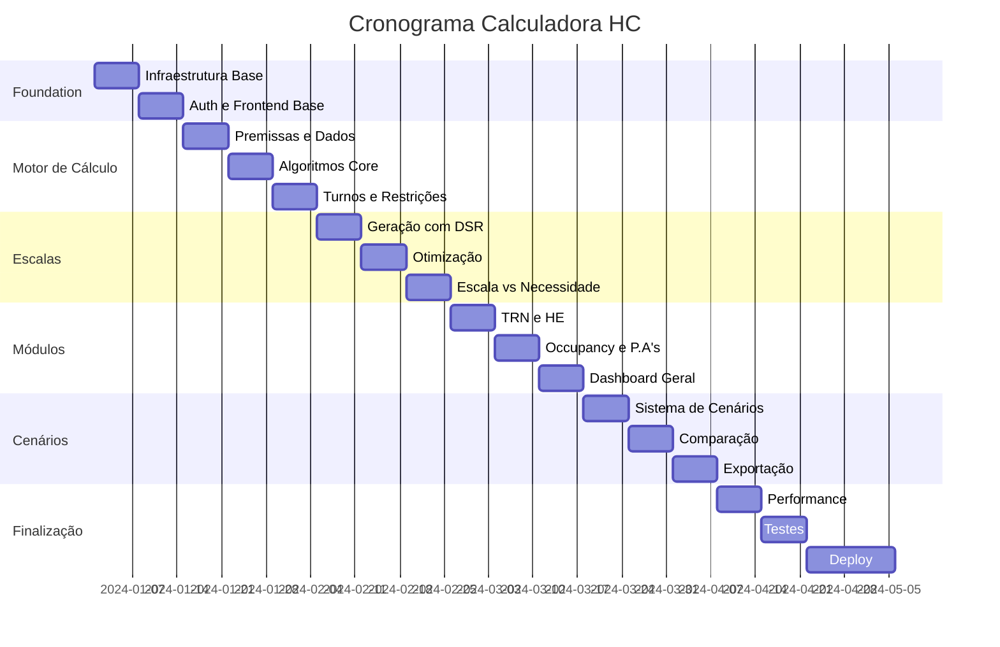

# Plano de Desenvolvimento - Calculadora HC

## 📋 Visão Geral do Projeto

### Objetivo
Desenvolver uma calculadora avançada para planejamento e dimensionamento de recursos humanos (HC - Head Count) em operações, com foco em otimização de escalas, garantia de SLA e eficiência financeira.

### Stack Tecnológica
- **Frontend**: React + Vite + TypeScript
  - TanStack Query (gerenciamento de estado e cache)
  - React Router (navegação)
  - Shadcn/UI + Tailwind CSS (design system)
  - Recharts (visualização de dados)
- **Backend**: Node.js + Fastify + TypeScript
  - Prisma ORM
  - PostgreSQL
  - JWT (autenticação)
  - Zod (validação)
- **Infraestrutura**:
  - Docker + Docker Compose
  - Redis (cache e filas)
  - Bull (processamento de jobs)

## 🏗️ Arquitetura do Sistema

### Estrutura do Projeto (Monorepo)
```
calculadora-hc/
├── packages/
│   ├── shared/          # Tipos e utilitários compartilhados
│   ├── backend/          # API Fastify
│   └── frontend/         # App React
├── docker/
├── docs/
└── scripts/
```

### Modelo de Dados Principal

#### Entidades Core
1. **Operation** (Operação)
   - id, name, description
   - workingHours (horário de atendimento)
   - slaTarget, slaPercentage
   
2. **PlanningPremise** (Premissas de Planejamento)
   - operationId
   - plannedMonth
   - volumeCurve (JSON)
   - tmiCurve, tmaCurve (JSON)
   - unproductivityPercentage
   
3. **WorkShift** (Turnos de Trabalho)
   - duration (6:20, 8:12, 4:00)
   - unproductivityRate
   - minLoginTime, maxLoginTime
   
4. **ResourceAllocation** (Alocação de Recursos)
   - operationId
   - date, timeInterval
   - requiredHCs, allocatedHCs
   - occupancy, slaAchieved
   
5. **Schedule** (Escala)
   - operationId, employeeId
   - date, shift
   - status (working, dayOff, training)
   
6. **Scenario** (Cenários)
   - name, description
   - userId, createdAt
   - premisesSnapshot (JSON)
   - resultsSnapshot (JSON)

## 📅 Fases de Desenvolvimento

### Fase 1: Foundation 
#### Sprint 1
- [ ] Setup do ambiente de desenvolvimento
- [ ] Configuração do monorepo com Turborepo
- [ ] Setup TypeScript + ESLint + Prettier
- [ ] Inicialização do backend Fastify
- [ ] Configuração Prisma + PostgreSQL
- [ ] Modelagem inicial do banco

#### Sprint 2  
- [ ] Setup do frontend Vite + React
- [ ] Configuração TanStack Query + Router
- [ ] Sistema de autenticação básico
- [ ] CI/CD pipeline básico
- [ ] Docker compose para desenvolvimento

### Fase 2: Core Features 
#### Sprint 3-4: Motor de Cálculo
- [ ] API de premissas de planejamento
- [ ] Algoritmo de cálculo de necessidade de HCs
- [ ] Cálculo de distribuição por intervalo
- [ ] API de curvas (volume, TMI/TMA)
- [ ] Validações de regras de negócio

#### Sprint 5-6: Interface de Input
- [ ] Tela de cadastro de operações
- [ ] Upload/input de curvas históricas
- [ ] Interface de premissas de planejamento
- [ ] Configuração de turnos e cargas horárias
- [ ] Validações em tempo real

### Fase 3: Escalas e Alocação 
#### Sprint 7-8: Sistema de Escalas
- [ ] Algoritmo de geração de escalas
- [ ] Regras DSR (Descanso Semanal Remunerado)
- [ ] Rotação de folgas (75% domingo trabalho)
- [ ] Interface de visualização de escalas
- [ ] Edição manual de escalas

#### Sprint 9-10: Otimização
- [ ] Algoritmo de otimização de alocação
- [ ] Balanceamento por turno
- [ ] Cálculo de occupancy
- [ ] Garantia de SLA por período
- [ ] Análise de eficiência financeira

### Fase 4: Módulos Especializados 
#### Sprint 11-12: Treinamento e HE
- [ ] Módulo de treinamento (TRN)
- [ ] Módulo de hora extra (HE)
- [ ] Curvas de liberação/entrada
- [ ] Impacto no SLA
- [ ] Ajuste de recursos logados

#### Sprint 13-14: Dashboards
- [ ] Dashboard Geral
- [ ] Aba Dimensionamento
- [ ] Aba Escala x Necessidade
- [ ] Aba Occupancy
- [ ] Aba P.A's (Performance Analytics)

### Fase 5: Features Avançadas 
#### Sprint 15-16: Cenários e Persistência
- [ ] Sistema de cenários
- [ ] Versionamento de premissas
- [ ] Comparação de cenários
- [ ] Histórico de alterações
- [ ] Backup e recuperação

#### Sprint 17-18: Exportação e Relatórios
- [ ] Exportação Excel/CSV
- [ ] Geração de relatórios PDF
- [ ] API de integração
- [ ] Webhooks para eventos
- [ ] Sistema de notificações

### Fase 6: Polish e Deploy 
- [ ] Testes E2E
- [ ] Otimização de performance
- [ ] Documentação completa
- [ ] Setup de produção
- [ ] Treinamento de usuários

## 🔧 Especificações Técnicas Detalhadas

### Backend API Endpoints

#### Autenticação
```
POST   /auth/login
POST   /auth/refresh
POST   /auth/logout
GET    /auth/me
```

#### Operações
```
GET    /operations
POST   /operations
GET    /operations/:id
PUT    /operations/:id
DELETE /operations/:id
```

#### Premissas
```
GET    /operations/:id/premises
POST   /operations/:id/premises
PUT    /premises/:id
POST   /premises/:id/import-curves
```

#### Cálculo e Dimensionamento
```
POST   /calculate/dimension
POST   /calculate/schedule
POST   /calculate/optimization
GET    /calculate/results/:id
```

#### Cenários
```
GET    /scenarios
POST   /scenarios
GET    /scenarios/:id
PUT    /scenarios/:id
POST   /scenarios/:id/clone
POST   /scenarios/compare
```

### Algoritmos Core

#### 1. Cálculo de Necessidade de HC
```typescript
interface CalculationInput {
  volume: number[];          // Curva de volume por intervalo
  tmi: number[];            // Tempo médio por intervalo
  targetSLA: number;        // Meta de SLA
  unproductivity: number;   // % improdutividade
}

function calculateHCNeed(input: CalculationInput): number[] {
  // Erlang C ou similar para dimensionamento
}
```

#### 2. Otimização de Escala
```typescript
interface ScheduleConstraints {
  minSundayWork: 0.75;      // 75% trabalhando domingo
  weeklyDayOffRatio: 1.25;  // 125% folgas semanais
  shiftGroups: ShiftGroup[];
}

function optimizeSchedule(
  needs: number[],
  constraints: ScheduleConstraints
): Schedule {
  // Algoritmo de otimização linear
}
```

### Componentes Frontend Principais

#### 1. PremiseInputForm
- Upload de arquivos CSV/Excel
- Inputs manuais de curvas
- Validação em tempo real
- Preview de gráficos

#### 2. DimensionChart
- Visualização de necessidade vs alocação
- Gráficos interativos por período
- Drill-down por turno
- Indicadores de SLA

#### 3. ScheduleGrid
- Grid editável de escalas
- Drag & drop para ajustes
- Validação de regras DSR
- Colorização por status

#### 4. ScenarioComparison
- Comparação lado a lado
- Diff de alterações
- Métricas comparativas
- Export de análise

## 🔒 Segurança e Performance

### Segurança
- **Autenticação e Autorização**
  - JWT com refresh tokens (expiração 15min/7dias)
  - RBAC (Role-Based Access Control)
  - MFA opcional para contas administrativas
  
- **Proteção de Dados**
  - Criptografia em trânsito (TLS 1.3)
  - Criptografia em repouso (AES-256)
  - Sanitização de inputs (XSS, SQL Injection)
  - CORS configurado restritivamente
  
- **Auditoria e Compliance**
  - Log de todas as alterações críticas
  - Audit trail com usuário, timestamp, ação
  - Compliance com LGPD/GDPR
  - Backup automático diário

- **Segurança da API**
  - Rate limiting por endpoint (100 req/min)
  - API keys para integrações externas
  - Validação de schemas com Zod
  - Proteção contra DDoS

### Performance
- **Otimizações Backend**
  - Cache Redis para cálculos pesados (TTL 5min)
  - Query optimization com índices compostos
  - Connection pooling PostgreSQL
  - Background jobs para processamento pesado
  - Compressão gzip/brotli
  
- **Otimizações Frontend**
  - Code splitting por rota
  - Lazy loading de componentes
  - Virtualização de listas grandes
  - Optimistic updates
  - Service Worker para cache offline
  - Bundle size < 500KB inicial
  
- **Infraestrutura**
  - CDN para assets estáticos
  - Auto-scaling horizontal
  - Load balancing com health checks
  - Monitoring com alertas automáticos

## 📊 Métricas de Sucesso

### KPIs Técnicos
| Métrica | Target | Medição |
|---------|--------|---------|
| Response Time (p95) | < 200ms | APM Tools |
| Uptime | > 99.9% | Monitoring |
| Error Rate | < 0.1% | Logs |
| Cobertura de Testes | > 80% | CI/CD |
| Bundle Size | < 500KB | Webpack |
| Time to Interactive | < 3s | Lighthouse |

### KPIs de Negócio
| Métrica | Target | Baseline | Prazo |
|---------|--------|----------|-------|
| Tempo de Planejamento | -50% | 4h → 2h | 6 meses |
| Precisão de Dimensionamento | +20% | 75% → 90% | 6 meses |
| SLA Médio | +15% | 80% → 92% | 9 meses |
| Eficiência de Custos | -10% | - | 12 meses |
| Satisfação do Usuário | > 4.5/5 | - | 6 meses |
| ROI | Positivo | - | 12 meses |

### Métricas de Adoção
- Usuários ativos mensais (MAU)
- Taxa de adoção por operação
- Número de cenários criados/mês
- Taxa de reutilização de templates
- Tempo médio de sessão

## 🎯 Cronograma Resumido

### Timeline Macro




### Milestones Principais

1. **M1 - MVP Básico** 
   - Login funcional
   - Upload de premissas
   - Cálculo de dimensionamento básico
   
2. **M2 - Escalas Funcionais**
   - Geração de escalas com DSR
   - Interface de edição
   - Validações completas
   
3. **M3 - Feature Complete** 
   - Todas as 8 abas funcionais
   - Sistema de cenários
   - Exportação/importação
   
4. **M4 - Production Ready** 
   - Testes completos
   - Documentação finalizada
   - Deploy em produção


## ✅ Critérios de Aceitação

### Critérios Técnicos
- [ ] Todas as funcionalidades das 8 abas implementadas
- [ ] Algoritmos de cálculo validados e precisos
- [ ] Sistema de escalas respeitando 100% regras DSR
- [ ] Performance dentro dos SLAs definidos
- [ ] Cobertura de testes > 80%
- [ ] Zero vulnerabilidades críticas de segurança
- [ ] Documentação técnica e de usuário completa

### Critérios de Negócio
- [ ] Aprovação em UAT por usuários-chave
- [ ] Treinamento de 100% dos usuários
- [ ] Migração de dados históricos (se aplicável)
- [ ] Integração com sistemas existentes
- [ ] SLA de suporte definido e operacional
- [ ] Plano de continuidade implementado

### Definição de "Pronto"
O projeto será considerado completo quando:
1. ✅ Todos os critérios técnicos atendidos
2. ✅ Todos os critérios de negócio atendidos
3. ✅ Sistema em produção há 30 dias sem incidentes críticos
4. ✅ Feedback positivo de pelo menos 80% dos usuários
5. ✅ Documentação aprovada e publicada
6. ✅ Handover para equipe de sustentação completo

---

